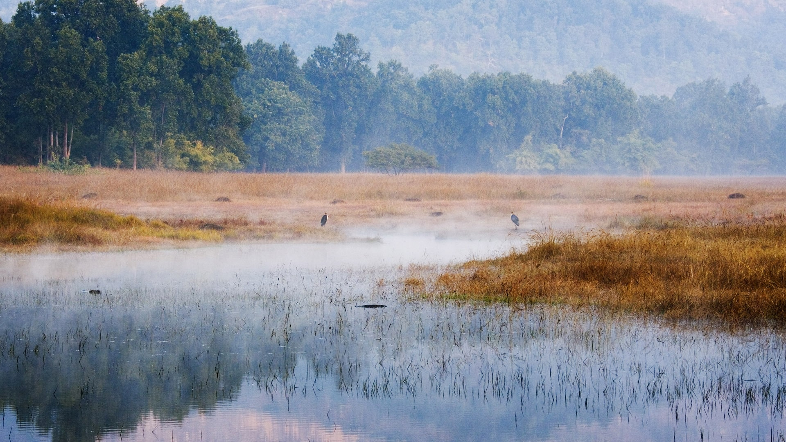
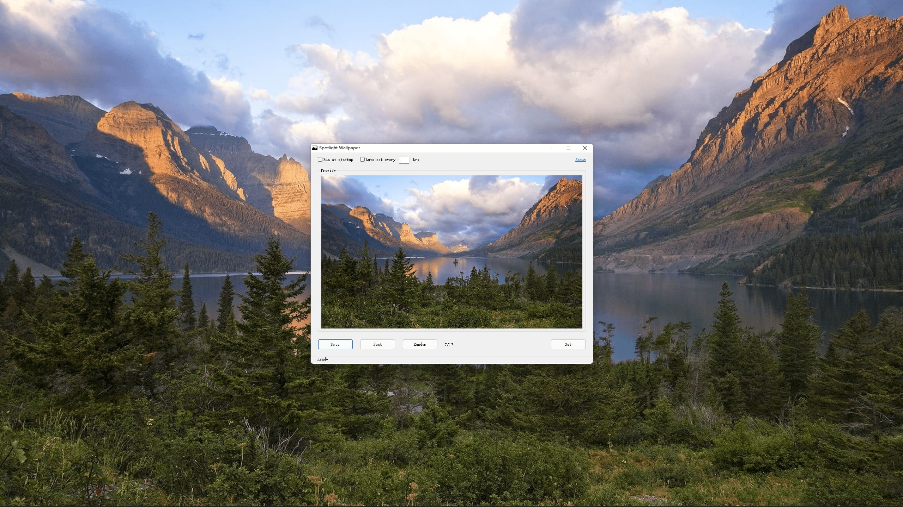

我的一直在用 Win10 电脑作为主力开发设备，Win10 系统比较新的版本有一项功能我非常喜欢，那就是“Windows 聚焦”。这项功能可以让你在锁屏界面使用一系列精美的摄影作品，这些精美的图片拍摄于全球各地，让你足不出户领略到各地的人文与自然风光。每天早上打开电脑，看到如此的美景，整个人一天的心情都好起来了。下面是一张随便挑选的 Windows 聚焦图片，可以感受一下（已压缩，实际的图片会更加清晰）：

但遗憾的是，Windows 聚焦图片无法直接设置为桌面壁纸。在查询了一些资料后，我了解到 Windows 聚焦的图片是直接保存在本地目录下的，随着用户点击锁屏界面的喜欢与否选项，这些图片会被自动更新。有了这些基础知识后，我就想着自己开发一款小软件来实现将 Windows 聚焦图片设置为桌面壁纸的功能。

## 梳理需求

虽然~~目前~~只有我一个用户，但流程还是要走的。这款小软件应该有如下需求：

1. 能够监听本地特定目录下的图片变化
2. 使用 [`Windows API`](https://docs.microsoft.com/en-us/windows/desktop/api/winuser/nf-winuser-systemparametersinfoa) 将图片设置为桌面壁纸
3. 可以预览图片
4. 可以通过用户设置定时更新壁纸

## 技术选型

有了需求后，如何在能满足需求且快速的情况下实现这些功能，对于技术选型，有如下两种考虑：

### Electron

优点：方便上手，我很熟悉前端相关技术，设置壁纸也有[第三方库](https://github.com/sindresorhus/wallpaper)

缺点：打包后的软件体积过大，且此软件只需要在 Windows 上运行，无需跨平台，引入 Electron 过于复杂

### C#、C++ 等相关原生技术

优点：运行效率高，打包后的软件体积小

缺点：我本人对这些技术不是很熟悉，需要学习，耗费较大的时间与精力

## 最终实现

那么有没有既能快速实现功能，又能贴合原生 Window GUI 的开发方案呢？答案是有的，那就是使用自动化的脚本语言，例如 Auto Hotkey。之所以使用“例如”二字，原因是我本来决定用 Auto Hotkey 来实现这些功能，奈何其语法相当复杂，难以上手，最终选择了 AutoIt。我觉得 AutoIt 有一个相当出彩的地方：那就是它由官方或者社区开发者提供了大量的 UDFs（User Defined Functions），能解决各式各样的问题。AutoIt 的核心内容非常简洁，新手（例如我）能快速开发一些自动化脚本来实现功能，同时 UDF 可以抽象出各种现实问题的解决方案，这样又可以支撑起复杂度较高的应用，实在是高明。

### 要点

1. 主循环渲染界面，在新开的线程中监听目录改动并发送消息到主循环中处理
2. 处理好各种的异常情况，抛出明确的信息以便于排查问题
3. 关闭程序时，应该同时结束开辟出来的新线程
4. 使用 AutoIt 官方提供的 `Tidy.exe` 程序整理代码
5. 可以使用界面设计工具而非手动布局提升开发效率

### 数据

1. 整体开发用了一个周末，一天时间学习语法，一天时间开发
2. [核心代码](https://github.com/chunqiuyiyu/spotlight-wallpaper/blob/main/SpotlightWallpaper.au3)不到 9KB，打包后的[程序](https://github.com/chunqiuyiyu/spotlight-wallpaper/releases) 683KB

### 预览

## 结语

SpotlightWallpaper 会根据图片的分辨率大小自动保存“横向”或者“纵向”的图片到用户主目录的“图片”文件夹下，这样不但有电脑端可用的壁纸资源，通过文件同步，我的手机和 iPad 上也能用上这些漂亮的壁纸图片，我还打算开发一款浏览器空白页的插件来在浏览器上展示它们，做到物尽其用。从一个小小的想法，到最后的作品，其中的距离，只有当你静下心来，才能慢慢跨越。
